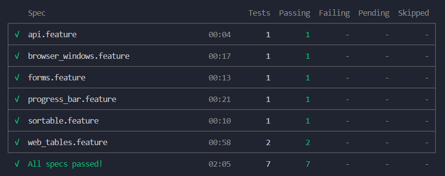

# ✅ Desafio de QA Automation – Accenture

Este projeto automatiza um fluxo completo de testes de API utilizando **Cypress** com **Cucumber (BDD)**. O fluxo é realizado na aplicação [DemoQA BookStore](https://demoqa.com/).

## Funcionalidades Testadas

### API
- Criação de um novo usuário
- Geração de token de autenticação
- Validação de autorização do usuário
- Listagem de livros disponíveis
- Aluguel de dois livros
- Validação dos dados do usuário e livros alugados

### Frontend
- Submeter formulário com dados válidos
- Abrir nova janela e validar conteúdo
- Criar, editar e deletar um registro
- Criar e deletar múltiplos registros dinamicamente
- Controlar e validar a barra de progresso
- Ordenar os itens da lista em ordem crescente


## Tecnologias e Ferramentas

- [Cypress](https://www.cypress.io/)
- [Cypress Cucumber Preprocessor](https://github.com/badeball/cypress-cucumber-preprocessor)
- JavaScript
- BDD (Behavior Driven Development)


## Como Executar o Projeto

1. **Clone o repositório**

```bash
git clone https://github.com/seu-usuario/desafio-qa-accenture.git
cd desafio-qa-accenture
``` 
2. **Instale as depedências**
 ``` bash
 npm instal
 ```
3. **Execute os testes no modo interativo**
``` bash
npx cypress open
```
**Ou em modo headless:**
```bash
npx cypress run
```
## 📊 Relatório de Execução dos Testes

<p align="center">
  
</p>